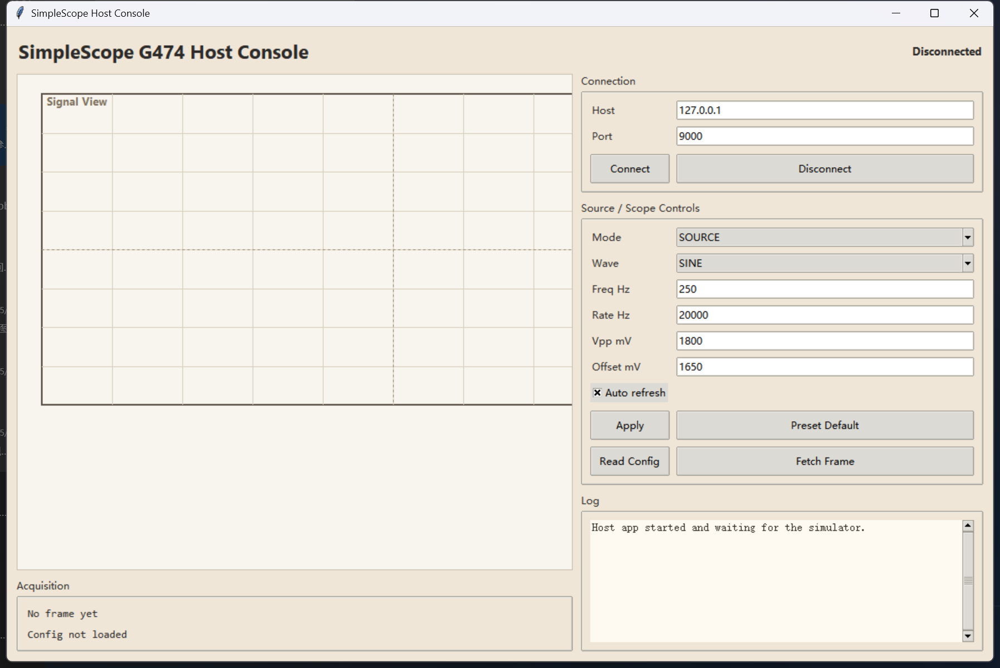

# 简易示波器与信号源

这是一个基于 `STM32G474VETx` 的简易示波器项目，包含三部分：

- 单片机固件：负责 TFT 显示、波形采样和内部测试波形生成
- 上位机软件：用于连接设备或模拟器，查看参数与抓取波形
- 下位机模拟器：在电脑上模拟单片机协议，便于脱离硬件联调

项目目标是在**不额外增加模拟前端电路**的前提下，利用现有资源完成一个可演示的简易信号源和示波器系统。



## 项目简介

当前工程支持两条使用路径：

1. 实物演示路径  
   程序烧录到 `STM32G474` 后，使用 `1.8` 寸 `ST7735` 屏幕横屏显示“更像示波器”的界面，包括顶部状态栏、右侧刻度、底部参数栏和中央波形区。
2. 电脑联调路径  
   运行 Python 上位机和 Python 下位机模拟器，在没有真实硬件输入信号的情况下，也能验证通信协议、参数调整和波形显示逻辑。

## 主要功能

- `SOURCE` 模式：单片机内部生成正弦波、三角波、方波、锯齿波，用于界面演示和功能验证
- `ADC` 模式：采样 `PA0 / ADC1_IN1` 的输入电压，并在屏幕上绘制波形
- 横屏示波器 UI：优化适配 `128 x 160` 的 `1.8` 寸屏幕，避免底部显示不完整
- 上位机控制：支持读取配置、抓取波形、切换模式、修改频率、峰峰值、偏置等参数
- 模拟器联调：不上板也能观察“示波器效果”和协议行为

## 目录结构

- `Core/`：主程序、示波器逻辑、TFT 驱动
- `Drivers/`：STM32 HAL / CMSIS 驱动
- `MDK-ARM/`：Keil 工程文件
- `docs/`：上手文档、快速说明、硬件规划说明
- `tools/`：上位机、下位机模拟器、协议辅助脚本
- `SimpleScope_G474.ioc`：STM32CubeMX 工程文件

## 硬件连接

### 主控

- `STM32G474VETx`

### 显示屏

- `1.8` 寸 `ST7735 TFT`
- 当前界面目标方向：**横屏显示**

### TFT 引脚

- `PE7`  -> `SCL`
- `PE8`  -> `SDA`
- `PE9`  -> `RST`
- `PE10` -> `DC`
- `PE11` -> `CS`
- `PE12` -> `BLK`

### 示波器输入

- `PA0` -> `ADC1_IN1`

### 下载调试

- `PA13` -> `SWDIO`
- `PA14` -> `SWCLK`
- `GND` 需要共地

### 安全说明

- `PA0` 输入电压必须在 `0V ~ 3.3V` 范围内
- 不要将超过 `3.3V` 或低于 `GND` 的电压直接输入到 `PA0`

## 固件编译与烧录

### 1. 打开 CubeMX 工程

打开 `SimpleScope_G474.ioc`，确认以下配置：

- MCU 为 `STM32G474VETx`
- `PA0 = ADC1_IN1`
- `PE7..PE12 = GPIO_Output`
- `PA13 / PA14 = Serial Wire`

然后生成 `MDK-ARM` 工程代码。

### 2. 打开 Keil 工程

打开 `MDK-ARM/SimpleScope_G474.uvprojx`，确认以下文件已加入工程：

- `Core/Src/tft_softspi.c`
- `Core/Src/scope_ui.c`
- `Core/Src/app_oscilloscope.c`

### 3. 编译并烧录

使用 ST-Link 或其他 SWD 下载器，将程序烧录到开发板。

## 怎么看到“示波器效果”

### 方式一：直接看板子屏幕

烧录成功后，TFT 会显示横屏示波器界面。

- 在 `SOURCE` 模式下，波形由固件内部生成，适合先检查 UI、刷新和参数变化
- 在 `ADC` 模式下，波形来自 `PA0` 输入

如果你在 `ADC` 模式下只接了固定直流电压，看到的大多会是一条平线；想看到明显变化的波形，需要给 `PA0` 输入一个随时间变化的安全信号。

### 方式二：运行上位机 + 模拟器

这条路径最适合先在电脑上确认“频率变了、峰峰值变了、波形跟着变化了”。

## 上位机与下位机模拟器使用方法

### 1. 启动下位机模拟器

运行：

```bat
tools\run_scope_mcu_simulator.cmd
```

默认监听地址：

- `127.0.0.1`
- 端口 `9000`

### 2. 启动上位机软件

运行：

```bat
tools\run_scope_host_app.cmd
```

然后在上位机中：

1. 将 `Host` 设置为 `127.0.0.1`
2. 将 `Port` 设置为 `9000`
3. 点击 `Connect`
4. 使用 `Apply`、`Fetch Frame` 等按钮查看和刷新波形

### 3. 上位机可用命令

- `HELLO`
- `GET CONFIG`
- `GET FRAME`
- `SET PRESET DEFAULT`
- `SET MODE SOURCE`
- `SET MODE ADC`
- `SET WAVE SINE`
- `SET WAVE TRIANGLE`
- `SET WAVE SQUARE`
- `SET WAVE SAW`
- `SET FREQ_HZ <value>`
- `SET RATE_HZ <value>`
- `SET VPP_MV <value>`
- `SET OFFSET_MV <value>`

## 推荐体验顺序

1. 先烧录固件，确认板载屏幕能正常横屏显示 UI
2. 先使用 `SOURCE` 模式，观察内部波形是否正常刷新
3. 再切换到 `ADC` 模式，给 `PA0` 输入安全测试信号
4. 电脑端运行模拟器和上位机，验证参数调节与波形联动效果

## 当前限制

- 当前仓库已经具备本地 TFT 显示能力
- 上位机已经可以完整控制 Python 模拟器
- 真实单片机侧的远程串口控制链路还没有完全打通

也就是说，目前最稳定的演示方式是：

- 实物板直接看屏幕显示
- 或在电脑上运行“上位机 + 模拟器”联调

## 相关文档

- [首次运行说明](docs/first_run_steps.md)
- [上位机与模拟器快速上手](docs/host_simulator_quickstart.md)
- [硬件规划说明](docs/oscilloscope_hardware_plan.md)

## 许可说明

仓库中包含 STM32CubeMX 生成的 HAL / CMSIS 相关文件。二次分发或复用时，请同时遵守 `Drivers/` 目录中对应的原始许可证要求。
